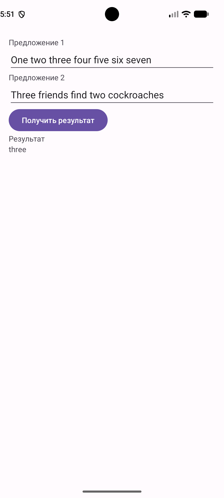

# Лабораторная работа №1 — вариант 24

Одноэкранное Android-приложение на Kotlin.

## Задание

Найдите самое длинное общее слово из двух заданных предложений.

## Как работает

На экране два поля с предложениями. При запуске они заполнены предопределёнными предложениями из кода, текст можно изменить. По нажатию кнопки «Получить результат» приложение находит слова, которые встречаются в обоих предложениях, и выводит самое длинное из них.

- регистр букв не учитывается: `Three` и `three` — одно слово;
- слова разделяются пробелами;
- если самых длинных общих слов несколько, выводятся все через запятую;
- если общих слов нет, выводится «Общих слов не найдено».

## Структура

- [`app/src/main/java/com/example/lab1variant24/domain/CommonWordFinder.kt`](app/src/main/java/com/example/lab1variant24/domain/CommonWordFinder.kt) — логика решения и исходные данные;
- [`app/src/main/java/com/example/lab1variant24/MainActivity.kt`](app/src/main/java/com/example/lab1variant24/MainActivity.kt) — связь экрана с логикой;
- [`app/src/main/res/layout/activity_main.xml`](app/src/main/res/layout/activity_main.xml) — разметка экрана.

Стек: Kotlin, XML-разметка, ViewBinding; minSdk 24.

## Скриншот

## Демонстрация

<video src="https://github.com/user-attachments/assets/c55bdf04-0a51-43ef-b66f-c93137546299" controls width="300"></video>

## Примеры

| Предложение 1 | Предложение 2 | Результат |
|---|---|---|
| One two three four five six seven | Three friends find two cockroaches | three |
| One two three four five six seven | ten | Общих слов не найдено |
| cat dog | dog cat | cat, dog |

## Запуск

Открыть папку `lab1-variant24` в Android Studio и нажать Run.
